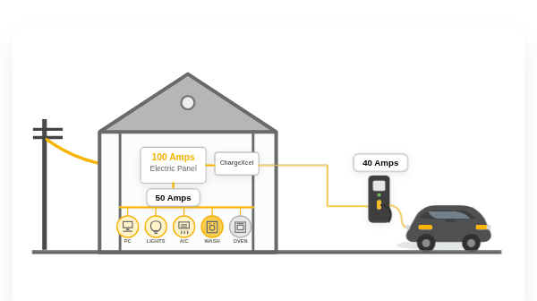

# ChargeXcel DLM plugins

DLM = Dynamic Load Management. **ChargeXcel is a load management system, not
an EV charger.** It sits on your electrical service, measures it with its own
current sensors, and sheds load by opening its relay before the service is
overdrawn. The EV charging station or car is a separate device downstream of
it.

<p align="center">
  
</p>

In this example the house has a 100 A service and its own appliances are
drawing up to 60 A. ChargeXcel watches the whole service, so the charging station
and everything else in the house together stay within what the service can
carry.

ChargeXcel knows how much spare capacity your service has, second by second.
For Tesla vehicles, it has a built-in connector that sets the charging current
directly through Tesla's cloud service. For everything else, it can't ask a car
to draw *less*; all it can do is cut the circuit. So it publishes that
headroom, and a **plugin** reads it, decides what the car or charging station
should draw, and tells that equipment what to do in its own protocol or cloud
API. All the plugin sends back is a status line for the owner's `/dlm` page:
whether it's active, and a few words on what it is doing.

This repo is everything you need to write one. It is **not** ChargeXcel's
firmware.

## The one rule

**Nothing a plugin sends is an input to any decision ChargeXcel makes.** No
field changes the current limit, the relay, or when load is shed. The firmware
enforces this in both directions, and the check itself is tested by
deliberately breaking it. So you can't break ChargeXcel by accident, and a
compromised plugin can't talk it into anything. ChargeXcel keeps shedding load
from its own sensors whether zero plugins are running or ten. See
[`docs/safety-properties.md`](docs/safety-properties.md).

## Two ways to plug in

| | On-device script | Off-board plugin |
|---|---|---|
| Runs on | ChargeXcel itself | any computer on the network (a Raspberry Pi, a server, a laptop) |
| Language | [Berry](https://berry-lang.github.io/) (a small Python-like language) | anything that can make HTTP requests |
| Talks to the equipment through | HTTPS calls to a cloud API (`dlm.http()`) | whatever you like: OCPP, a local API, a cloud API |
| Good for | vendors with a cloud API; no extra hardware | local protocols, heavy logic, anything the script limits rule out |
| Start with | [`docs/on-device-scripts.md`](docs/on-device-scripts.md), [`scripts/`](scripts/) | [`docs/http-api.md`](docs/http-api.md), [`reference-plugin/`](reference-plugin/) |

A unit runs at most one on-device script. Off-board plugins work alongside
it, and each has its own key. You choose between the on-device script, no
connector, and ChargeXcel's **built-in Tesla connector** on the Connector card
of the unit's `/dlm` page. Tesla support is part of the firmware, not a
plugin.

## What's here

- [`docs/telemetry-and-advisory.md`](docs/telemetry-and-advisory.md): every
  figure ChargeXcel publishes, and the two things you send back.
- [`docs/on-device-scripts.md`](docs/on-device-scripts.md): the script API,
  its limits, and how to write a good script.
- [`docs/http-api.md`](docs/http-api.md): the `/api/dlm/v1/tick` route for
  off-board plugins.
- [`docs/safety-properties.md`](docs/safety-properties.md): what the
  contract guarantees, each stated as the failure it prevents.
- [`scripts/`](scripts/): example on-device scripts. `epiccharging.be` and
  `smartcar.be` have run against those vendors' real APIs.
- [`runner/`](runner/): `cxl-run`, which tests a script on your own computer
  with the same Berry VM and limits the unit uses.
- [`reference-plugin/`](reference-plugin/): a complete off-board plugin in
  about 150 lines of Python.

## Try a script in two minutes

```sh
make -C runner
./runner/cxl-run scripts/smartcar.be --ticks 3 \
    --responses scripts/replay/smartcar.txt --secrets scripts/replay/smartcar.secrets
./runner/cxl-run scripts/smartcar.be --set allowed_amps=3 \
    --responses scripts/replay/smartcar.txt --secrets scripts/replay/smartcar.secrets
```

The first command starts the car and then stays quiet. The second one sees
only 3 A of headroom and stops it.

## Versioning

The tick response carries `"schema": 2`. A breaking change to what an
off-board plugin receives gets a new number. The script API is versioned
with the firmware. [`runner/vm/FIRMWARE_VERSION`](runner/vm/FIRMWARE_VERSION)
says which firmware release the runner's VM was copied from.

## License

MIT. See [`LICENSE`](LICENSE). The Berry interpreter under `runner/vm/berry/`
is also MIT (© Guan Wenliang); see its own
[`LICENSE`](runner/vm/berry/upstream/LICENSE).
